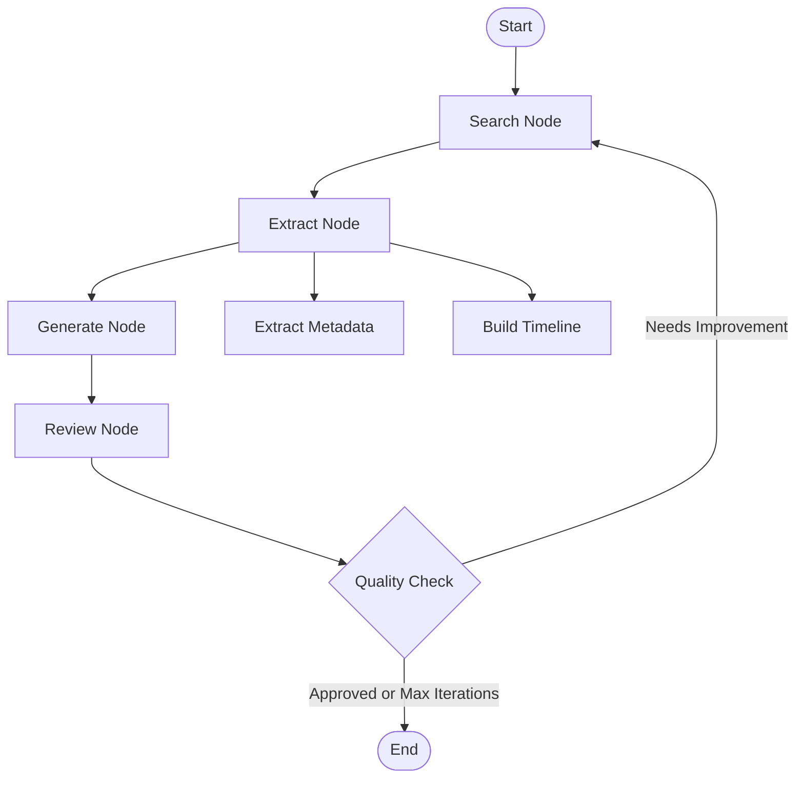

# Incident Analysis Agent

A production-ready LangGraph agent that automatically generates comprehensive incident reports by searching for relevant information, extracting structured data, and iteratively improving report quality.

## Features

- **Structured Input Processing**: Accepts date, company, and incident description
- **Intelligent Web Search**: Tavily-powered search with caching for cost optimization
- **Structured Data Extraction**: Pydantic models for consistent metadata parsing
- **Timeline Construction**: Chronological event sequencing from multiple sources
- **Root Cause Analysis**: Structured incident reports following industry templates
- **Quality Review Loop**: Automated review and iterative improvement
- **Error Handling**: Graceful degradation with comprehensive error tracking
- **Progress Tracking**: Real-time status updates and completion monitoring
- **Production Ready**: Logging, caching, and environment configuration

## Architecture

### Workflow Graph



### State Schema
```python
class IncidentState(TypedDict):
    # Input
    date: str
    company: NotRequired[str]
    incident_description: NotRequired[str]
    
    # Search & Processing
    search_keywords: Annotated[List[str], operator.add]
    search_results: Annotated[List[dict], operator.add]
    metadata: NotRequired[IncidentMetadata]
    timeline: Annotated[List[TimelineEvent], operator.add]
    
    # Output & Quality
    incident_report: NotRequired[str]
    missing_info: Annotated[List[str], operator.add]
    review_result: NotRequired[dict]
    
    # Control & Monitoring
    iteration_count: int
    progress: NotRequired[ProgressStatus]
    errors: Annotated[List[str], operator.add]
```

### Structured Models

**IncidentMetadata**: Start/end times, affected services, severity, status
**TimelineEvent**: Timestamp, event description, source
**IncidentReport**: Summary, timeline, root cause, impact, resolution
**ProgressStatus**: Real-time completion tracking

### Workflow Nodes

1. **Search Node**: Tavily-powered web search with intelligent caching
2. **Extract Node**: Structured metadata extraction and timeline construction
3. **Generate Node**: LLM-powered report generation with structured output
4. **Review Node**: Quality assessment and approval logic

## Files

- `incident_agent.py`: Basic implementation with mock tools
- `incident_agent_enhanced.py`: LLM integration version
- `incident_agent_tavily.py`: Tavily search with caching
- `incident_agent_production.py`: **Full production version with all features**
- `test_incident_agent.py`: Test suite and examples

## Usage

### Quick Start
```bash
# Install dependencies
just install

# Run tests
just test

# Run basic agent
just run

# Run enhanced version (requires API keys)
just run-enhanced

# Run production version (full features)
just run-production
```

### Environment Setup
```bash
# Copy template and add your API keys
cp .env.example .env
# Edit .env with your actual keys
```

### Configuration (.env)
```bash
# Required API Keys
OPENAI_API_KEY=your-openai-api-key-here
TAVILY_API_KEY=your-tavily-api-key-here

# Optional Configuration
OPENAI_BASE_URL=https://api.openai.com/v1
OPENAI_MODEL=gpt-4o-mini
```

### Example Input
```python
initial_state = {
    "date": "November 2024",
    "company": "AWS", 
    "incident_description": "S3 service disruption affecting multiple regions",
    "search_keywords": [],
    "search_results": [],
    "timeline": [],
    "missing_info": [],
    "iteration_count": 0,
    "errors": [],
    "progress": ProgressStatus()
}
```

## Production Features

### ✅ **Implemented**
- **Tavily Search Integration**: Real web search with intelligent caching
- **Structured Data Processing**: Pydantic models for consistent parsing
- **Timeline Construction**: Chronological event sequencing
- **Error Handling**: Graceful degradation and comprehensive logging
- **Progress Tracking**: Real-time status monitoring
- **Environment Configuration**: Flexible API endpoint and model selection
- **Cost Optimization**: Search result caching and content truncation

### 🔄 **Available Versions**
1. **Basic** (`incident_agent.py`): Mock implementation for testing
2. **Enhanced** (`incident_agent_enhanced.py`): LLM-powered with basic search
3. **Tavily** (`incident_agent_tavily.py`): Real search with caching
4. **Production** (`incident_agent_production.py`): Full feature set

## Key Design Decisions

1. **Minimal Codebase**: Only essential functionality, no verbose implementations
2. **Structured Output**: Pydantic models ensure consistent data formats
3. **Error Resilience**: Continues operation with partial failures
4. **Cost Awareness**: Intelligent caching and API usage optimization
5. **Progress Visibility**: Real-time tracking for long-running operations
6. **Flexible Configuration**: Environment-based API and model selection

## Dependencies

- `langgraph>=1.0.2`: Core orchestration framework
- `langchain-openai>=1.0.0`: LLM integration
- `tavily-python>=0.3.0`: Web search API
- `pydantic>=2.0.0`: Structured data validation
- `python-dotenv>=1.0.0`: Environment configuration

## Testing

```bash
just test  # Run basic functionality tests
```

## Production Considerations

### ✅ **Implemented**
- Real web search with Tavily API integration
- Intelligent caching for cost optimization
- Comprehensive error handling and logging
- Structured data validation with Pydantic
- Progress tracking and monitoring
- Flexible environment configuration

### 🚀 **Ready for Extension**
- Multi-source validation and cross-referencing
- Historical incident pattern analysis
- Compliance reporting (SOC2, GDPR)
- Integration with incident management systems
- Advanced monitoring and alerting
